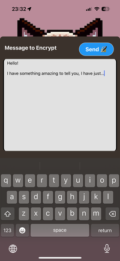
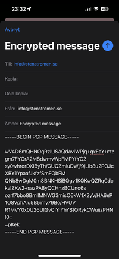

# GrumpyPGP

React Native app for sending encrypted emails using PGP.

The lack of a good PGP app for iOS makes the cat grumpy.

*PGP is a standard for encrypting messages using public key cryptography. It's a great way to send secure messages to people without having to worry about the security of the channel you're using to send the message. It's also a great way to store encrypted messages in a database, since the messages can only be decrypted by the intended recipient.*

## App Store Link

## Dependencies

- **react-native-mail:** This package provides functionality to compose and send emails within a React Native app. It allows for more advanced features such as adding attachments and customizing the email interface.

- **react-native-swipe-up-down:** A React Native component designed to enable swipe up and swipe down gestures. It's useful for creating interactive interfaces where users can swipe to reveal or hide content.

- **react-native-webview:** This module provides a way to render web content in a React Native app. It's used to embed a web browser view, allowing you to display web pages or run web-based applications within your app.

- **OpenPGP.js:** This library provides a JavaScript implementation of the OpenPGP standard. It's used to encrypt and decrypt messages using public key cryptography.

## Screenshots

   
